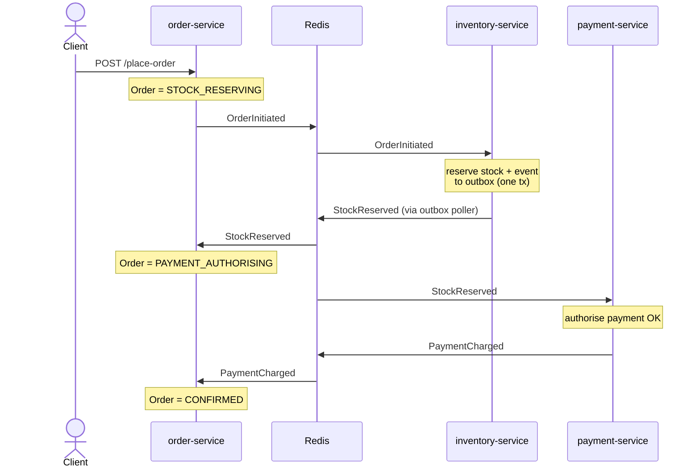
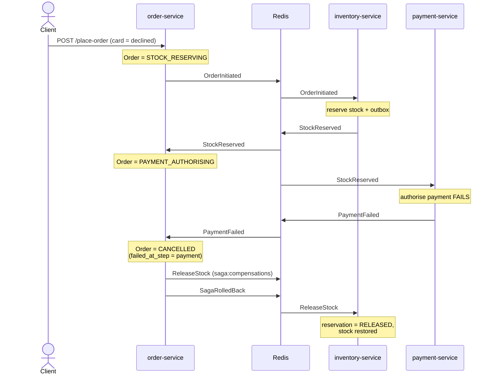

# saga-pattern

A **choreography-based Saga** for an e-commerce order flow, built as a Python [`uv`](https://docs.astral.sh/uv/) workspace monorepo. An order moves through three services that coordinate purely via Redis pub/sub events — no central orchestrator:

```
order → inventory → payment
```

- **order-service** (`:8000`) — places orders and **owns compensation**: on a downstream failure it issues `ReleaseStock` and rolls the saga back.
- **inventory-service** (`:8001`) — reserves stock and publishes through a **transactional outbox** (state change + event committed atomically).
- **payment-service** (`:8002`) — authorises payment against a mock PayPal client.
- **dashboard** (`:8003`) — live **SSE** feed of every saga event.

Events flow on two Redis channels: `saga:events` (facts) and `saga:compensations` (commands).

## Saga flows

Services never call each other directly — every arrow to/from **Redis** below is an event *published* to a channel and consumed by whoever subscribes. `order-service` is the coordinator that owns compensation.

### Happy path



### Compensation path (payment declined)



> If stock is insufficient, inventory emits `StockUnavailable` instead of `StockReserved`, and the order cancels at the inventory step (`failed_at_step = inventory`) — nothing was reserved, so there's no stock to release.

## Run with Docker

```bash
docker compose up --build
```

Starts Postgres, Redis, the three services, and the dashboard. If you run Postgres/Redis on the host, **stop them first** — the stack binds `5432`/`6379`.

### Seed stock (required)

Inventory creates its schema on startup. Once the stack is up, seed a few products:

```bash
docker compose exec -T db psql -U root -d saga <<'SQL'
INSERT INTO inventory.stock_inventory (item_id, item_name, unit_price, available_qnty) VALUES
  ('apple',  'Apple',  50, 100),
  ('banana', 'Banana', 20, 100),
  ('cherry', 'Cherry', 80, 100),
  ('mango',  'Mango',  90, 100),
  ('grape',  'Grape',  30, 100)
ON CONFLICT (item_id) DO UPDATE SET available_qnty = EXCLUDED.available_qnty;
SQL
```

### Watch it run

Open the dashboard at **http://localhost:8003**, then place orders:

```bash
# happy path  -> StockReserved -> PaymentCharged -> CONFIRMED
curl -s -X POST localhost:8000/place-order -H 'Content-Type: application/json' \
  -d '{"item_id":"apple","quantity":3,"customer_id":"me","card_token":"tok"}'

# declined    -> PaymentFailed -> ReleaseStock -> SagaRolledBack -> CANCELLED
curl -s -X POST localhost:8000/place-order -H 'Content-Type: application/json' \
  -d '{"item_id":"apple","quantity":3,"customer_id":"me","card_token":"declined"}'
```

Check an order's status: `curl -s localhost:8000/order/<order_id>`.

## Local development (without Docker)

Services read config from `.env` (copy it from `.env.example`) and need a local Postgres + Redis (both `root`/`root`). The dev runner restarts all four services fresh and seeds stock:

```bash
bash run.sh
```

## Layout

```
packages/   broker (Redis pub/sub), db (SQLAlchemy async), events (Pydantic event contracts)
services/   order-service, inventory-service, payment-service, dashboard
```
